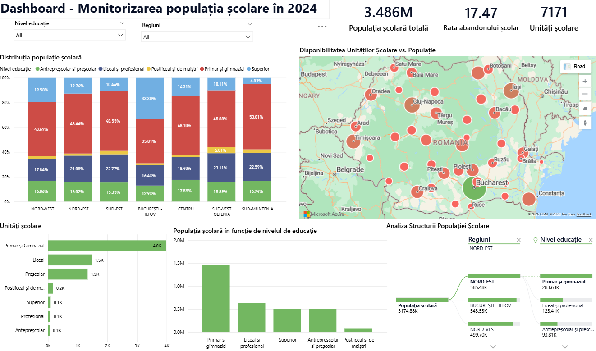

# Project Overview
This project analyzes how demographic decline and regional disparities impact Romania’s education system.
The objective is to transform official statistical data into clear, actionable insights that support
data-driven decision-making in education and public administration.

# Data
The analysis is based on official national and European data sources, covering the period 1995–2024.
The project explores long-term trends in the school population, differences across education levels,
and regional and urban–rural disparities.

# Methodology
- Data preprocessing and indicator calculation in Microsoft Excel
- Exploratory data analysis and visualization
- Development of interactive dashboards in Power BI

# Tools Used
- Microsoft Excel
- Power BI

# Key Outcomes
- Identified long-term decline in the school population
- Highlighted regional and urban–rural disparities
- Provided visual tools to support educational planning and policy decisions

## Preview

